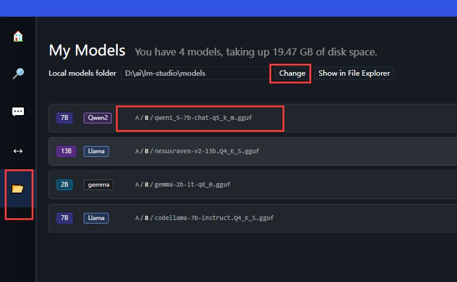
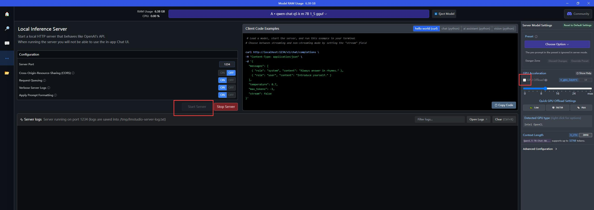
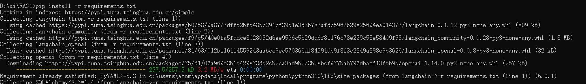
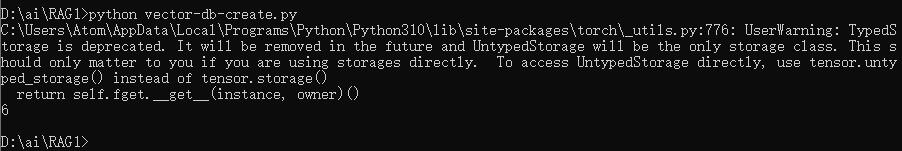
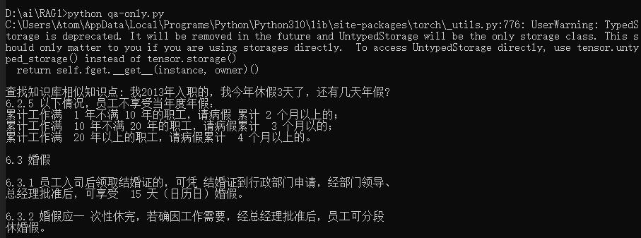
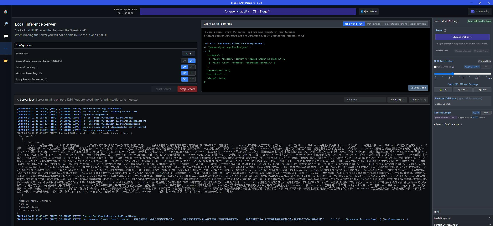
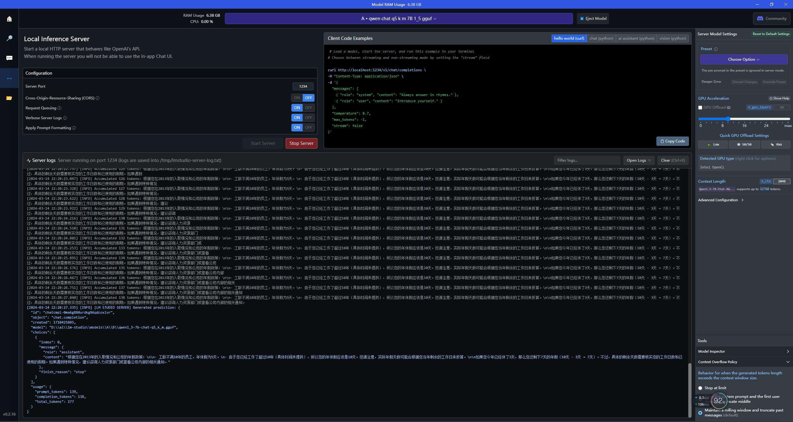
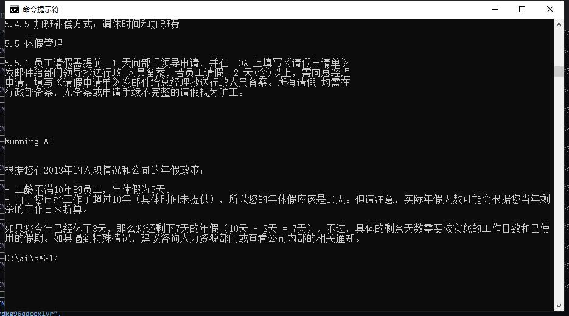

# 使用LM Studio + Chroma + LangChain实现基于知识库的问答


## 应用场景
希望借助通用大模型，结合单位自己的知识库（如规章制度、产品介绍等）提供更加智能的问答服务。


## 主要思路
根据查询得知，在不改动已经训练好的模型的前提下，可以通过外挂知识库的内容进行“检索增强”，改技术叫RAG，更多知识点可自行搜索。主要的思路如下：
1. 准备知识库内容，如pdf、word、excel、txt、md等文件；
2. 将知识库内容导入向量数据库；
3. 进行问答时，第一步先从向量库内获取与问题关联度较高的信息；
4. 将上一步中获取的信息，结合一些提示指令，输入给LLM模型回答；
5. 得到想要的答案或给出不知道的提示。


## 实现步骤
*本项目主要是一次可行性验证，为像我一样刚开始了解RAG相关知识的人员提供一个能够走通的方案。*

*以下步骤为从零开始，在一台全新的Windows Server服务器上的操作步骤。*


### 1.安装python
```
版本：3.10.6
下载地址：https://www.python.org/downloads/release/python-3106/
下载版本：Windows installer (64-bit)
安装方式：直接双击安装即可
版本查看：安装完毕后再打开cmd窗口，输入python -V，会看到“Python 3.10.6”
设置镜像：pip config set global.index-url https://pypi.tuna.tsinghua.edu.cn/simple
```


### 2.安装LM Studio
```
版本：0.2.16
下载地址：https://lmstudio.ai/，点击“Download LM Studio for Windows 0.2.16”按钮下载
安装方式：直接双击，等安装成功后打开；
下载模型：LM Studio内可直接点击模型并下载，但是一直报网络错误，可直接下载模型并设置路径，模型使用的是阿里千问：https://huggingface.co/Qwen/Qwen1.5-7B-Chat-GGUF/resolve/main/qwen1_5-7b-chat-q5_k_m.gguf
导入模型：将上一步下载的模型放到D:\ai\lm-studio\models目录下，点击LM Studio左侧文件夹图标，然后点击“Change”,选择该目录即可；
启动服务：点击LM Studio左侧第三个图标（双向箭头），点击“Start Server”即可以服务形式运行模型，并自动提供api。
注意：如电脑有独立显卡，可勾选下右侧的可选框“GPU Offload”
```




### 3.安装Chroma向量数据库
```
参考地址：https://docs.trychroma.com/getting-started?lang=py
安装方式（CMD）：pip install chromadb
```


### 4.安装导入知识库需要的依赖
如本项目存放路径为D:\ai\RAG1,那么在CMD中执行：
```
D:
cd ai\RAG1
pip install -r requirements.txt
```
上述步骤会自动下载解析需要的模型，**电脑网络环境必须能访问https://huggingface.co/**，如出错可重复执行几次，有时网络环境不稳会报错。




### 5.导入知识库
CMD中，在D:\ai\RAG1下执行：
```
python vector-db-create.py
```
成功执行后，在D:\ai\RAG1\chroma_db_test1下回看到一个.sqlite3文件，这个文件有兴趣可通过Navicat打开看看。




### 6.验证一个问题回答

CMD中，在D:\ai\RAG1下执行：
```
python qa-only.py
```
qa-only.py文件可打开自行编辑提示和问题；执行后等待结果即可。（如电脑有显卡会很快出答案，如没有，得等几十秒）








## 写在后面
上述流程是一个简单的验证性实例，说明理论上是可行的，要应用到正式项目中，可能还需要解决：
1. 知识库的人工梳理和准备；
2. 向量库的手动修正；
3. python脚本化运行需与常见的java等后台进行交付
4. 使用控制放在业务系统侧，本服务仅做回答，知识库的选取也由业务系统指定。


## 主要参考
1. https://cloud.tencent.com/developer/article/2295783
2. https://medium.com/@mr.ghulamrasool/quick-and-dirty-building-a-private-conversational-agent-for-healthcare-a-journey-with-lm-studio-f782a56987bd
